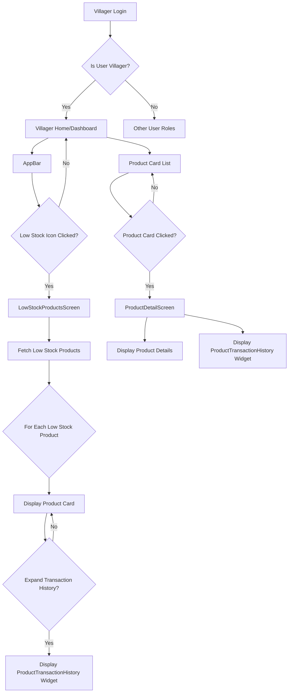
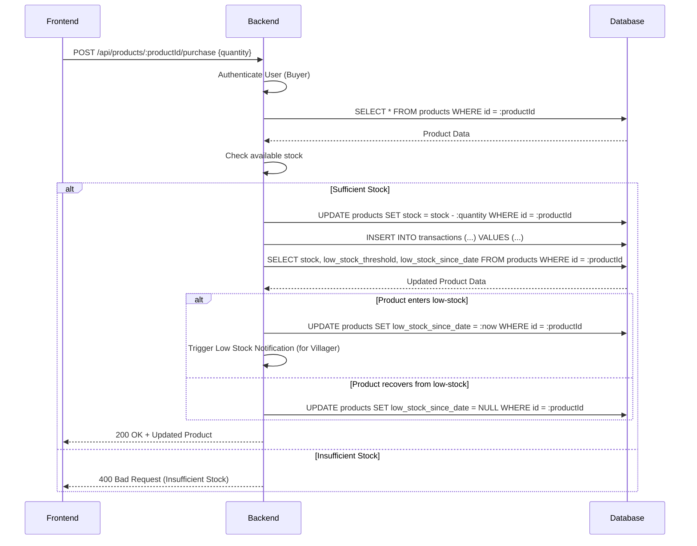

# MODIFICATION_DESIGN.md

## 1. Overview

This document outlines the design for enhancing the "Lung Chaing Farm" application with a low-stock monitoring and sales transaction history feature. The primary goal is to provide Villager users with real-time insights into their low-stock products and historical sales data for each product. This involves modifications to the Flutter frontend, Node.js backend, and the SQLite database schema.

## 2. Detailed Analysis of the Goal or Problem

The existing application allows Villagers to manage products and view a "Low Stock Overview" on their dashboard. However, it lacks a prominent, easily accessible indicator for low-stock products and a detailed historical view of sales for individual products.

The current request introduces the following features:

*   **Low Stock Indicator in AppBar:** A "shopping cart-like" icon in the AppBar, visible only to Villager users, displaying a badge with the count of *currently* low-stock products. Clicking this icon should navigate to a dedicated low-stock products view.
*   **Low Stock Products View:** This view (likely an enhanced section of the existing Villager Dashboard or a new screen) will list all products that are currently below their defined low-stock threshold. For each product, it will display the current stock and the date the product *entered* its low-stock state.
*   **Expandable Transaction History:** Within the low-stock products view, each product entry will have an expandable section that, when clicked, reveals its sales transaction history. This history will show the date and quantity sold ("day with how many kg user pull for") for each transaction.
*   **Product Card Transaction History:** When any product card (from any product listing, not just low-stock) is clicked, it should navigate to a product details view that also presents the sales transaction history for that product.
*   **Backend Transaction Storage:** The backend must record every sale transaction, including the product sold, quantity, and date.
*   **Automated Transaction Deletion:** Removed, as per user's decision to retain all transaction data. Archival to CSV will be handled externally.
*   **`low_stock_since_date` Tracking:** The backend must track and update a `low_stock_since_date` field for each product, recording when its stock first falls below its threshold. This date should be cleared when the stock recovers above the threshold.

## 3. Alternatives Considered

### 3.1. Storing `low_stock_since_date`

*   **Option A: Add `low_stock_since_date` to `products` table (Chosen)**
    *   **Pros:** Simple to implement, directly links the low-stock status to the product.
    *   **Cons:** Requires updating the product record frequently. If the stock fluctuates above and below the threshold, the `low_stock_since_date` might change multiple times, potentially losing the *initial* date it first went low since the feature was implemented.
    *   **Rationale for Choice:** Given the current requirements, tracking the *most recent* date a product entered low-stock state is sufficient. This option is efficient and avoids creating additional tables for simple timestamping.

*   **Option B: Separate `low_stock_events` table:**
    *   **Pros:** Provides a full historical log of every time a product entered/exited low stock.
    *   **Cons:** Over-complicates the requirement since the user only asked for the "date the product entered a low-stock state" (singular) and not a full history. Increases database complexity and query overhead.

### 3.2. Automated Transaction Deletion

*   **Option B: No automated deletion (Chosen - as per user's request)**
    *   **Pros:** Retains full historical data in the database. Simplifies backend implementation by removing cron job.
    *   **Cons:** Database size will continuously grow, potentially impacting long-term performance without a robust archival strategy. Requires external management (e.g., CSV export) for data offloading.
    *   **Rationale for Choice:** User explicitly requested to keep all transaction data in SQLite and manage archival externally.

### 3.3. Transaction History Storage

*   **Option A: New `transactions` table (Chosen)**
    *   **Pros:** Clear separation of concerns, optimized for transaction data.
    *   **Cons:** Requires a new table and associated schema changes.
    *   **Rationale for Choice:** This is the most appropriate and scalable solution for storing historical sales data.

## 4. Detailed Design for the Modification

### 4.1. Database Schema Changes

A new table, `transactions`, will be created to store sales records. The `products` table will be modified to include `low_stock_since_date`.

#### `products` table modification:

```sql
-- Add a new column to track when a product entered a low-stock state
ALTER TABLE products ADD COLUMN low_stock_since_date INTEGER; -- Stored as Unix timestamp
```

#### New `transactions` table:

```sql
CREATE TABLE transactions (
    id INTEGER PRIMARY KEY AUTOINCREMENT,
    product_id INTEGER NOT NULL,
    quantity_sold INTEGER NOT NULL,
    date_of_sale INTEGER NOT NULL, -- Unix timestamp
    user_id INTEGER NOT NULL, -- The user who bought the product
    FOREIGN KEY (product_id) REFERENCES products(id) ON DELETE CASCADE,
    FOREIGN KEY (user_id) REFERENCES users(id) ON DELETE CASCADE
);
```

### 4.2. Backend (Node.js with Express) Design

#### 4.2.1. New API Endpoints

*   **`POST /api/products/:productId/purchase`**:
    *   **Purpose:** Handles a product purchase, decrements stock, records transaction, updates `low_stock_since_date`.
    *   **Input:** `productId` (path param), `quantity` (body).
    *   **Logic:**
        1.  Authenticate user (Buyer role required).
        2.  Fetch product by `productId`.
        3.  Check if `quantity` is available.
        4.  Decrement `stock` in `products` table.
        5.  Create a new entry in `transactions` table with `product_id`, `quantity_sold`, `date_of_sale` (current timestamp), `user_id`.
        6.  Check if new `stock` is below `low_stock_threshold`:
            *   If yes, and `low_stock_since_date` is NULL, set `low_stock_since_date` to current timestamp in `products` table.
            *   If no, and `low_stock_since_date` is NOT NULL, set `low_stock_since_date` to NULL.
        7.  Return updated product information.
        8.  **Trigger Notifications:** If product enters low-stock state, send notification (e.g., socket.io, for future implementation as "toast ...something").
*   **`GET /api/villager/low-stock-products`**:
    *   **Purpose:** Retrieve all products for the authenticated Villager that are currently below their low-stock threshold.
    *   **Logic:**
        1.  Authenticate user (Villager role required).
        2.  Fetch products where `owner_id` matches Villager's ID AND `stock` < `low_stock_threshold`.
        3.  Return product details including `low_stock_since_date`.
*   **`GET /api/products/:productId/transactions`**:
    *   **Purpose:** Retrieve sales transaction history for a specific product, with optional filtering by time period.
    *   **Input:** `productId` (path param), `days` (query parameter, optional, e.g., `?days=30`).
    *   **Logic:**
        1.  Authenticate user (Villager role required, and must be owner of `productId`).
        2.  Fetch all `transactions` for `productId`.
        3.  If `days` query parameter is provided, filter transactions to include only those within the last `days` from the current date.
        4.  Order by `date_of_sale` descending.
        5.  Return transaction details (date, quantity sold).

### 4.2.2. Transaction Data Retention

*   The application will retain all sales transaction data in the SQLite database.
*   The previous plan for automated deletion of old transactions has been removed.
*   Archival of old data to CSV will be handled externally by the user.

### 4.3. Frontend (Flutter) Design

#### 4.3.1. State Management (`AuthProvider` and new `LowStockProvider`)

*   **`AuthProvider`:** Will need to identify if the logged-in user is a Villager.
*   **New `LowStockProvider` (or extend existing `AuthProvider`):**
    *   Purpose: Manages the state of low-stock products for the authenticated Villager.
    *   Contains: `List<Product>` of low-stock products, `lowStockCount`.
    *   Methods:
        *   `fetchLowStockProducts()`: Calls `GET /api/villager/low-stock-products`.
        *   `getLowStockCount()`: Returns the number of low-stock products.
    *   Will notify listeners when `lowStockCount` changes.

#### 4.3.2. AppBar Low Stock Indicator

*   **Component:** An `IconButton` with a `Badge` widget.
*   **Placement:** In the `AppBar` of screens accessible to Villagers.
*   **Icon:** Use the provided `@assets/icons/shop-cart.png`.
*   **Badge Content:** Dynamically display `LowStockProvider.lowStockCount`.
*   **Navigation:** On tap, navigate to the `LowStockProductsScreen`.

#### 4.3.3. `LowStockProductsScreen` (New Screen/Section)

*   **Access:** Navigated to from the AppBar indicator.
*   **Content:**
    *   Fetches and displays `List<Product>` from `LowStockProvider`.
    *   For each product: `ProductCard` (or similar widget) showing product details, current stock, and `low_stock_since_date`.
    *   An `ExpansionTile` or similar widget to reveal `ProductTransactionHistory` component.

#### 4.3.4. `ProductTransactionHistory` Widget (New Reusable Widget)

*   **Purpose:** Displays a list of transactions for a given product.
*   **Input:** `productId`.
*   **Logic:**
    *   Fetches transaction data using `GET /api/products/:productId/transactions`.
    *   Displays each transaction as "User buy total" and "date".

#### 4.3.5. Product Card & Detail Screen Modifications

*   **Product Card (`product_card.dart`):** Modify to make the entire card tappable. On tap, navigate to a `ProductDetailScreen` (if not already existing, otherwise enhance existing one).
*   **`ProductDetailScreen`:** This screen will display comprehensive product information and include the `ProductTransactionHistory` widget for the specific product.

### 4.4. UI/UX Considerations

*   **Notifications:** Implement transient `SnackBar` messages for successful purchases or when a product enters a low-stock state (for Villagers).
*   **Loading States:** Ensure appropriate loading indicators are displayed while fetching data (e.g., `CircularProgressIndicator`).
*   **Empty States:** Display a clear message when there are no low-stock products or no transaction history.

## 5. Diagrams

### 5.1. Database Schema (Mermaid Entity-Relationship Diagram)

```mermaid
erDiagram
    users ||--o{ products : "owns"
    products ||--o{ product_images : "has"
    products ||--o{ transactions : "has"

    users {
        INTEGER id PK
        TEXT email
        TEXT password_hash
        TEXT role
        TEXT farm_name
    }

    products {
        INTEGER id PK
        TEXT name
        REAL price
        INTEGER stock
        TEXT category
        INTEGER low_stock_threshold
        INTEGER owner_id FK "users.id"
        INTEGER low_stock_since_date NULL "Unix timestamp"
    }

    product_images {
        INTEGER id PK
        INTEGER product_id FK "products.id"
        TEXT image_path
    }

    transactions {
        INTEGER id PK
        INTEGER product_id FK "products.id"
        INTEGER quantity_sold
        INTEGER date_of_sale "Unix timestamp"
        INTEGER user_id FK "users.id"
    }
```

### 5.2. Frontend Flow (Mermaid Flowchart)



### 5.3. Backend Data Flow for Purchase (Mermaid Sequence Diagram)



## 6. Summary

This design integrates low-stock monitoring and sales transaction history into the Lung Chaing Farm application, primarily for Villager users. It involves adding a `transactions` table and `low_stock_since_date` to the `products` table in the SQLite database. The backend will handle new API endpoints for purchases, low-stock product retrieval, and transaction history with filtering. All transaction data will be retained in the database as per user's request. The Flutter frontend will feature an AppBar badge, a dedicated low-stock products screen with expandable transaction history, and enhanced product card interactions. This approach provides a clear and actionable path to fulfilling the requested features.

## 7. References to Research URLs

*   **SQLite `ALTER TABLE ADD COLUMN`:** [https://www.sqlite.org/lang_altertable.html](https://www.sqlite.org/lang_altertable.html)
*   **`node-cron` package:** [https://www.npmjs.com/package/node-cron](https://www.npmjs.com/package/node-cron)
*   **Flutter `Badge` widget:** [https://api.flutter.dev/flutter/material/Badge-class.html](https://api.flutter.dev/flutter/material/Badge-class.html)
*   **Flutter `ExpansionTile` widget:** [https://api.flutter.dev/flutter/material/ExpansionTile-class.html](https://api.flutter.dev/flutter/material/ExpansionTile-class.html)
*   **Mermaid Entity Relationship Diagrams:** [https://mermaid.js.org/syntax/entityRelationshipDiagram.html](https://mermaid.js.org/syntax/entityRelationshipDiagram.html)
*   **Mermaid Flowcharts:** [https://mermaid.js.org/syntax/flowchart.html](https://mermaid.js.org/syntax/flowchart.html)
*   **Mermaid Sequence Diagrams:** [https://mermaid.js.org/syntax/sequenceDiagram.html](https://mermaid.js.org/syntax/sequenceDiagram.html)