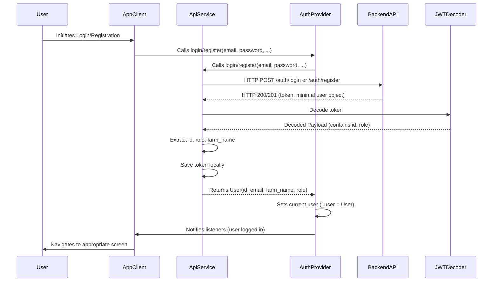

# MODIFICATION DESIGN DOCUMENT: Fixing "null is not number" in Authentication

## 1. Overview

This document outlines the design to resolve a "null is not number" error occurring during user registration and login in the Lung Chaing Farm Flutter application. The problem is identified as a likely failure to correctly decode the JSON Web Token (JWT) received from the backend API and extract the `id` and `role` fields, which are crucial for client-side logic, as indicated in the `GEMINI.md` project overview. The proposed solution involves integrating a `jwt_decoder` package to parse the JWT and update the `User` model and `AuthProvider` with the extracted `id` and `role`.

## 2. Detailed Analysis of the Goal/Problem

The `GEMINI.md` document explicitly states under "Secure Authentication": "The login API now returns a token and a minimal user object (`{ farm_name: user.farm_name }`). This design choice requires the client-side application to decode the JWT to retrieve the user's `id` and `role` for its logic and UI, which adds a layer of client-side complexity but reduces redundancy in the initial API response."

However, a review of the `MODIFICATION_IMPLEMENTATION.md` for the `feature/one-page-marketplace` branch does not show any explicit steps for implementing this client-side JWT decoding and extraction of `id` and `role`. The "null is not number" error strongly suggests that a part of the application is attempting to use `id` or `role` (expected to be numeric) from a `User` object where these fields are still `null`, because they were never properly extracted from the JWT. This is critical as the `id` and `role` are fundamental for role-based access control and user-specific functionality throughout the application.

## 3. Alternatives Considered

*   **Modify Backend to Return Full User Object:** One alternative would be to modify the backend API to return the full user object, including `id` and `role`, directly in the login/registration response. This would simplify the frontend logic. However, this contradicts the stated "design choice" in `GEMINI.md` to keep the API response minimal and perform JWT decoding on the client for reduced redundancy. Adhering to the existing design principles is preferred unless a significant blocker is encountered. Therefore, this alternative is rejected.

## 4. Detailed Design for the Modification

The design focuses on implementing the missing client-side JWT decoding and integrating the extracted `id` and `role` into the application's state management.

### 4.1. Add `jwt_decoder` Package

The `jwt_decoder` package (`https://pub.dev/packages/jwt_decoder`) will be added to the `pubspec.yaml` as a dependency. This package provides a simple and reliable way to decode JWTs in Dart.

### 4.2. Update `User` Model (`lib/models/user.dart`)

The `User` model will be updated to include `id` (as an `int`) and `role` (as a `String`). These fields will be made nullable initially (`int? id`, `String? role`) to gracefully handle cases where they might not be present (e.g., during initial unauthenticated states or if the token lacks these claims). The `fromJson` factory will be updated to parse these fields from the JWT payload.

```dart
// lib/models/user.dart
class User {
  final int? id; // New field
  final String email;
  final String farmName;
  final String? role; // New field

  User({this.id, required this.email, required this.farmName, this.role});

  factory User.fromJson(Map<String, dynamic> json) {
    return User(
      id: json['id'] as int?,
      email: json['email'] as String,
      farmName: json['farm_name'] as String,
      role: json['role'] as String?,
    );
  }

  Map<String, dynamic> toJson() {
    return {
      'id': id,
      'email': email,
      'farm_name': farmName,
      'role': role,
    };
  }
}
```

### 4.3. Implement JWT Decoding and User Object Creation in `ApiService` and `AuthProvider`

The core logic for decoding the JWT and updating the `User` object will reside primarily in `ApiService` and `AuthProvider`.

#### `ApiService` (`lib/services/api_service.dart`)

The `login` and `register` methods in `ApiService` will be modified. After successfully receiving a `token` from the backend, these methods will:
1.  Decode the JWT using `JwtDecoder.decode()`.
2.  Extract the `id` and `role` from the decoded JWT payload.
3.  Return a `User` object that now includes the extracted `id`, `role`, along with the `email` (from login/register input) and `farmName` (from the minimal user object in the API response).

```dart
// lib/services/api_service.dart (conceptual changes)
import 'package:jwt_decoder/jwt_decoder.dart';
// ... other imports

class ApiService {
  // ... existing code

  Future<User> login(String email, String password) async {
    final response = await http.post(
      Uri.parse('$baseUrl/auth/login'),
      headers: {'Content-Type': 'application/json'},
      body: json.encode({'email': email, 'password': password}),
    );

    if (response.statusCode == 200) {
      final responseData = json.decode(response.body);
      final String token = responseData['token'];
      final Map<String, dynamic> decodedToken = JwtDecoder.decode(token);

      // Extract id and role from decoded token
      final int? id = decodedToken['id'] as int?;
      final String? role = decodedToken['role'] as String?;
      final String farmName = responseData['user']['farm_name']; // From minimal user object

      // Store token (e.g., using shared_preferences)
      await _saveToken(token);

      return User(id: id, email: email, farmName: farmName, role: role);
    } else {
      throw ApiException(json.decode(response.body)['message']);
    }
  }

  Future<User> register(String email, String password, String farmName, String role) async {
    final response = await http.post(
      Uri.parse('$baseUrl/auth/register'),
      headers: {'Content-Type': 'application/json'},
      body: json.encode({
        'email': email,
        'password': password,
        'farm_name': farmName,
        'role': role,
      }),
    );

    if (response.statusCode == 201) {
      final responseData = json.decode(response.body);
      final String token = responseData['token'];
      final Map<String, dynamic> decodedToken = JwtDecoder.decode(token);

      // Extract id and role from decoded token
      final int? id = decodedToken['id'] as int?;
      final String? role = decodedToken['role'] as String?;

      // Store token (e.g., using shared_preferences)
      await _saveToken(token);

      return User(id: id, email: email, farmName: farmName, role: role);
    } else {
      throw ApiException(json.decode(response.body)['message']);
    }
  }

  // Helper to load user from stored token on app start or refresh
  Future<User?> _loadUserFromToken() async {
    final token = await _getToken();
    if (token != null && !JwtDecoder.isExpired(token)) {
      final Map<String, dynamic> decodedToken = JwtDecoder.decode(token);
      final int? id = decodedToken['id'] as int?;
      final String? email = decodedToken['email'] as String?; // Assuming email is also in token
      final String? role = decodedToken['role'] as String?;

      // We might need to fetch farm_name separately if it's not in the token
      // For now, let's assume farm_name is not strictly needed for _loadUserFromToken initial setup
      if (email != null && id != null && role != null) {
        return User(id: id, email: email, farmName: 'Unknown Farm', role: role); // Placeholder farmName
      }
    }
    return null;
  }
}
```

#### `AuthProvider` (`lib/providers/auth_provider.dart`)

`AuthProvider` will be responsible for managing the authenticated `User` object across the application.
1.  The `_user` field will be of type `User?`.
2.  The `login` and `register` methods will call the respective `ApiService` methods, receive the fully populated `User` object, and set it to `_user`.
3.  A method `checkAuthStatus` will be added or modified to attempt to load a user from a stored token on app startup, using `ApiService._loadUserFromToken()`.

### 4.4. Error Handling

*   **JWT Decoding Errors:** Wrap `JwtDecoder.decode()` calls in `try-catch` blocks to handle malformed tokens.
*   **Missing Claims:** Handle cases where `id` or `role` might be missing from the decoded JWT payload by using nullable types (`int?`, `String?`) and providing default behavior or throwing specific exceptions.
*   **API Exceptions:** Continue to use `ApiException` for backend-related errors.

### 4.5. Usage of `id` and `role`

All existing and future code that depends on `user.id` or `user.role` (e.g., for routing, UI rendering, authorization checks) will now access these properties from the `User` object available through `AuthProvider`. This ensures consistent and correctly populated data.

## 5. Diagrams

### Sequence Diagram: Enhanced Authentication Flow



## 6. Summary

This design addresses the "null is not number" error by implementing robust client-side JWT decoding. It involves:
1.  Adding the `jwt_decoder` package.
2.  Updating the `User` model to include `id` and `role`.
3.  Modifying `ApiService` to decode JWTs, extract `id` and `role`, and construct a complete `User` object.
4.  Updating `AuthProvider` to manage this fully populated `User` object.
5.  Ensuring proper error handling for JWT operations.
This approach aligns with the existing design choice for client-side JWT processing and provides a stable foundation for role-based features.

## 7. References

*   `jwt_decoder` package: [https://pub.dev/packages/jwt_decoder](https://pub.dev/packages/jwt_decoder)