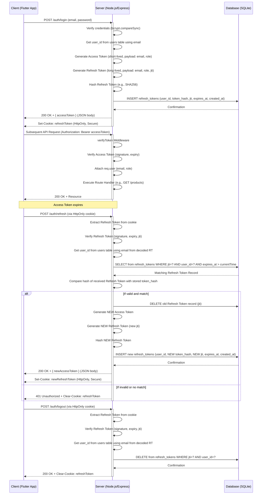

# Modification Design Document: Implementing Refresh Tokens and Token Revocation

## 1. Overview

This document outlines the design for enhancing the authentication system of the Lung Chaing Farm application by implementing a robust refresh token mechanism alongside token revocation capabilities. The primary goals are to improve security by utilizing short-lived access tokens and to enhance user experience by providing persistent login sessions without frequent re-authentication.

## 2. Detailed Analysis of the Goal or Problem

The current authentication system relies solely on a single, long-lived JWT access token. While simple, this approach presents significant security and user experience challenges:

*   **Security Risk with Long-Lived Tokens:** If a long-lived access token is compromised, an attacker gains prolonged unauthorized access until the token naturally expires. There is no immediate mechanism to invalidate or revoke a compromised token.
*   **Lack of Immediate Revocation:** In events such as user logout, password change, or account compromise, the current system cannot immediately invalidate an issued access token. It must wait for the token's natural expiration.
*   **Poor User Experience with Short-Lived Tokens (if implemented alone):** Switching to very short-lived access tokens (e.g., 5-15 minutes) would improve security by limiting the window of exposure, but it would severely degrade the user experience by forcing frequent re-logins.

The goal is to address these issues by introducing:
*   **Short-lived Access Tokens:** To minimize the impact of token compromise.
*   **Long-lived Refresh Tokens:** To allow users to obtain new access tokens without re-entering credentials, maintaining a smooth user experience.
*   **Server-Side Token Revocation:** To enable immediate invalidation of refresh tokens (and by extension, access to new access tokens) upon logout or security events.

## 3. Alternatives Considered

### a) "Multiple Secrets Per Role" for JWT Verification (Rejected)

*   **Description:** This approach involved using different `JWT_SECRET` keys for each user role (e.g., `VISITOR_JWT_SECRET`, `USER_JWT_SECRET`, `VILLAGER_JWT_SECRET`) to allow more granular control over token issuance and validation.
*   **Reason for Rejection:** Research indicates that this is generally *not* a recommended best practice. It introduces significant complexity in managing multiple secrets, key rotation, and the verification process within the middleware. The security gains are often minimal compared to the complexity, as the primary authentication logic remains similar across roles. A single, robust secret with role claims in the payload, combined with proper authorization middleware, is the established best practice.

### b) Short-lived Access Tokens Only (Rejected)

*   **Description:** Issue only short-lived access tokens (e.g., 5-15 minutes) and require users to re-authenticate with their username and password once the token expires.
*   **Reason for Rejection:** This offers high security but results in a very poor user experience due to frequent mandatory re-logins, making the application cumbersome to use.

### c) Long-lived Access Tokens Only (Rejected)

*   **Description:** Continue with the current system of using a single, long-lived access token.
*   **Reason for Rejection:** This was rejected due to the severe security implications. A compromised long-lived token grants an attacker extended, undetectable access, and there's no way to revoke it instantly.

### d) Static "Random Number" in JWT Payload for Verification (Rejected)

*   **Description:** The proposal was to add a static "random number" (e.g., `"21284y789012y4981238098"`) to the JWT payload during signing and then check for its presence and specific value in the `verifyToken` middleware.
*   **Reason for Rejection:** This approach provides obfuscation rather than true cryptographic security. If the `JWT_SECRET` is compromised, an attacker can simply include the known "random number" in their forged tokens. It doesn't add a new layer of cryptographic integrity beyond what `jwt.verify()` already provides and is considered "security by obscurity," which is not a recommended practice. It also introduces inflexibility, as changing the "random number" would invalidate all existing tokens.

## 4. Detailed Design for the Modification

The chosen design incorporates short-lived access tokens and long-lived, server-side-managed refresh tokens with a robust revocation mechanism.

### 4.1. New Database Table: `refresh_tokens`

A new table will be created in the SQLite database to store and manage refresh tokens. This table will enable server-side tracking and revocation.

**Schema Definition:**

```sql
CREATE TABLE IF NOT EXISTS refresh_tokens (
    id INTEGER PRIMARY KEY AUTOINCREMENT,
    user_id INTEGER NOT NULL,
    token_hash TEXT NOT NULL UNIQUE, -- Store a cryptographic hash of the refresh token
    jti TEXT NOT NULL UNIQUE,       -- JWT ID claim from the refresh token payload
    expires_at INTEGER NOT NULL,    -- Unix timestamp for refresh token expiration
    created_at INTEGER NOT NULL,    -- Unix timestamp for refresh token creation
    FOREIGN KEY (user_id) REFERENCES users(id) ON DELETE CASCADE
);
```

**Field Purposes:**
*   `id`: Primary key, auto-incrementing integer.
*   `user_id`: Foreign key referencing the `users` table, linking the refresh token to a specific user. `ON DELETE CASCADE` ensures refresh tokens are deleted if the user is deleted.
*   `token_hash`: Stores a cryptographic hash (e.g., SHA256) of the refresh token. The raw refresh token is never stored directly for security.
*   `jti`: A unique JWT ID claim included in the refresh token's payload. This identifier is used for specific token revocation and whitelisting.
*   `expires_at`: A Unix timestamp indicating when the refresh token expires. This allows for automatic cleanup of expired tokens and validation.
*   `created_at`: A Unix timestamp indicating when the refresh token was created.

**Indexing:**
Indexes will be added to `user_id` and `jti` columns to ensure efficient lookups during validation and revocation operations.

### 4.2. Authentication Flow Changes

The existing `/auth/login` endpoint will be modified, and two new endpoints, `/auth/refresh` and `/auth/logout`, will be introduced.

#### a) Modified Login Endpoint (`POST /auth/login`)

The `login` endpoint will now:
1.  Authenticate user credentials (email, password) as before.
2.  Upon successful authentication:
    *   **Generate an Access Token:** A new JWT (Access Token) will be created with a **short expiration time** (e.g., 15 minutes). Its payload will contain `email` and `role`.
    *   **Generate a Refresh Token:** A new JWT (Refresh Token) will be created with a **long expiration time** (e.g., 7 days or more). Its payload will contain `email`, `role`, and a unique `jti` (JWT ID). A cryptographically secure random string will be used to generate the `jti`.
    *   **Store Refresh Token:** The Refresh Token's raw string will be cryptographically hashed. This hash, along with its `jti`, `user_id` (retrieved from `users` table based on `email`), `expires_at`, and `created_at` will be stored in the new `refresh_tokens` database table.
    *   **Response:**
        *   The **Access Token** will be sent in the JSON response body.
        *   The **Refresh Token** will be set as an `HttpOnly`, `Secure` cookie in the response headers. `HttpOnly` prevents client-side JavaScript access (mitigating XSS), and `Secure` ensures it's only sent over HTTPS.

#### b) New Refresh Endpoint (`POST /auth/refresh`)

This new endpoint will handle refreshing expired access tokens using a valid refresh token.
1.  **Request:** The client will send an API request to this endpoint. The Refresh Token will be automatically sent via the `HttpOnly` cookie.
2.  **Verification:**
    *   Extract the Refresh Token from the `HttpOnly` cookie.
    *   Verify the Refresh Token's signature using `JWT_SECRET`.
    *   Extract `email`, `role`, and `jti` from the Refresh Token's payload.
    *   **Whitelisting Check:** Query the `refresh_tokens` table using the extracted `jti` and `user_id` (derived from email) to ensure the token is valid and not expired/revoked. Also, compare the hash of the *received* refresh token with the `token_hash` stored in the database.
3.  **Refresh Token Rotation:** If the Refresh Token is valid and matches the stored hash:
    *   Invalidate the old Refresh Token by deleting its record from the `refresh_tokens` table.
    *   Generate a **new short-lived Access Token** and a **new long-lived Refresh Token** with a new `jti`.
    *   Hash the new Refresh Token and store its details (hash, new `jti`, `user_id`, `expires_at`, `created_at`) in the `refresh_tokens` table.
    *   **Response:** Send the new Access Token in the JSON response body and set the new Refresh Token in an `HttpOnly`, `Secure` cookie.
4.  **Error Handling:** If the Refresh Token is invalid, expired, or not found in the whitelist, return a 401 Unauthorized response, prompting the user to re-login.

#### c) New Logout Endpoint (`POST /auth/logout`)

This new endpoint will handle user logout and immediately revoke the refresh token.
1.  **Request:** The client will send an API request to this endpoint. The Refresh Token will be automatically sent via the `HttpOnly` cookie.
2.  **Revocation:**
    *   Extract the Refresh Token from the `HttpOnly` cookie.
    *   Verify the Refresh Token's signature.
    *   Extract `email`, `role`, and `jti` from the Refresh Token's payload.
    *   Delete the corresponding record from the `refresh_tokens` table using the `jti` (or `user_id` if revoking all tokens for a user), effectively revoking the Refresh Token and all associated Access Tokens.
    *   Clear the Refresh Token cookie on the client side.
3.  **Response:** Return a 200 OK response indicating successful logout.

### 4.3. Middleware (`verifyToken`)

The `verifyToken` middleware will remain largely the same but will now **specifically operate on the short-lived Access Tokens** received in the `Authorization: Bearer <token>` header.
1.  Extract the Access Token.
2.  Verify its signature using `JWT_SECRET`.
3.  Ensure it's not expired.
4.  Attach `req.user = decoded` (containing `email` and `role`) to the request object.
5.  Call `next()` if valid, otherwise return 401 Unauthorized.

### 4.4. `JWT_SECRET` Management

*   The existing `JWT_SECRET` will be used for both Access Token and Refresh Token signing.
*   It will remain stored securely in environment variables.

## 5. Diagrams (Mermaid format)

### 5.1. Authentication Flow Sequence Diagram



### 5.2. Database ER Diagram Update

```mermaid
erDiagram
    users ||--o{ products : "owns"
    products ||--o{ product_images : "has"
    products ||--o{ transactions : "has"
    users ||--o{ refresh_tokens : "has"

    users {
        INTEGER id PK
        TEXT email
        TEXT password_hash
        TEXT role
        TEXT farm_name
    }

    products {
        INTEGER id PK
        TEXT name
        REAL price
        INTEGER stock
        TEXT category
        INTEGER low_stock_threshold
        INTEGER owner_id FK "users.id"
        INTEGER low_stock_since_date NULL "Unix timestamp"
    }

    product_images {
        INTEGER id PK
        INTEGER product_id FK "products.id"
        TEXT image_path
    }

    transactions {
        INTEGER id PK
        INTEGER product_id FK "products.id"
        INTEGER quantity_sold
        INTEGER date_of_sale "Unix timestamp"
        INTEGER user_id FK "users.id"
    }

    refresh_tokens {
        INTEGER id PK
        INTEGER user_id FK "users.id"
        TEXT token_hash UNIQUE
        TEXT jti UNIQUE
        INTEGER expires_at
        INTEGER created_at
    }
```

## 6. Summary of the Design

This design provides a robust and secure authentication system by:
*   Employing **short-lived access tokens** to reduce the security risk of compromised tokens.
*   Utilizing **long-lived refresh tokens** stored securely in `HttpOnly`, `Secure` cookies and tracked server-side in a database.
*   Implementing **refresh token rotation** to enhance security by ensuring refresh tokens are single-use.
*   Enabling **immediate token revocation** upon logout or security events by deleting corresponding records from the `refresh_tokens` table.
*   Maintaining a seamless user experience by allowing silent token refreshing in the background.

This approach balances strong security with practical usability, aligning with modern authentication best practices for JWT-based systems.

## 7. References to Research URLs

*   [JWT Best Practices - DigitalOcean](https://www.digitalocean.com/community/tutorials/how-to-implement-jwt-authentication-in-nodejs-and-mongodb) (General JWT practices, refresh token concept)
*   [Secure JWTs: Refresh Tokens - Fenil Sonani](https://fenilsonani.com/articles/secure-jwts-refresh-tokens) (Detailed refresh token flow, rotation)
*   [JWT Revocation Strategies - SuperTokens](https://supertokens.com/blog/jwt-revocation-strategies) (Token blacklisting/whitelisting)
*   [Implementing Refresh Tokens - Medium](https://medium.com/@sherry_j_c_wang/implementing-refresh-tokens-jwt-in-node-js-6d9b4b0e8b2b) (Implementation details for Node.js)
*   [HttpOnly Cookies and JWT - Snyk](https://snyk.io/blog/jwt-authentication-best-practices/) (Secure cookie usage for refresh tokens)
*   [JWT and SQLite Best Practices - Stack Overflow](https://stackoverflow.com/questions/59695484/best-practice-for-storing-jwt-refresh-tokens-in-sqlite) (SQLite schema for refresh tokens)
*   [JWT security best practices for 2024 - Serverion](https://serverion.com/jwt-security-best-practices/) (General security practices)
*   [JWT authentication using Node.js - GeeksforGeeks](https://www.geeksforgeeks.org/jwt-authentication-using-node-js/) (Basic Node.js JWT setup)
*   [Best Practices for Secure JWT Authentication - Auth0](https://auth0.com/blog/brute-forcing-tokens-what-you-need-to-know/) (Comprehensive JWT security)